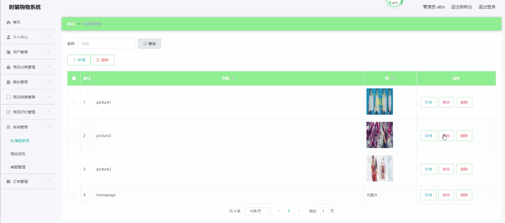
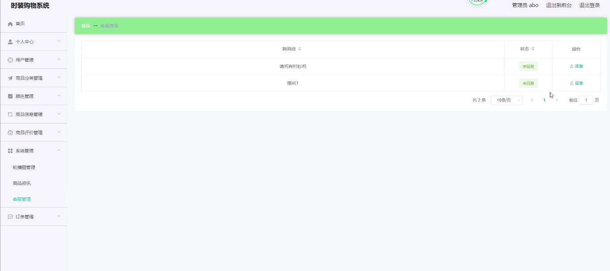

**项目简介：**  
本项目基于主流的前后端分离架构，采用 **SpringBoot + Vue 技术栈**，配套 **MySQL 数据库**，适用于毕业设计与课题实训开发。  
本人已整理了超 **4000 多套毕业设计源码+论文+开题报告+PPT...**，涵盖 **Java、SpringBoot、Vue、SSM、uni-app 小程序、PHP、Android** 等方向，支持功能修改定制与论文服务。  
**团队提供以下服务：**  
- 项目代码修改与调试  
- 数据库配置与远程协助  
- 论文定制与修改  
**获取更多的4000多套源码或SQL文件请联系：**  
- QQ：3906443360 微信：BesheHelp

# springboot004网页时装购物系统

5.1管理员功能模块

管理员登录，通过填写注册时输入的用户名、密码、角色进行登录，如图5-1所示。

图5-1管理员登录界面图

管理员登录进入时装购物系统可以查看首页、个人中心、用户管理、商品分类管理、颜色管理、商品信息管理、商品评价管理、系统管理、订单管理等信息。

用户管理，在用户管理页面中可以通过填写用户名、密码、姓名、头像、性别、联系电话进行详情、修改，如图5-2所示。还可以根据需要对商品分类管理进行详情，修改或删除等详细操作，如图5-3所示。

图5-2用户管理界面图

图5-3商品分类管理界面图

颜色管理，在颜色管理页面中可以查看颜色等信息，并可根据需要对颜色管理进行详情、修改或删除等操作，如图5-4所示。

图5-4颜色管理界面图

商品信息管理，在商品信息管理页面中可以查看商品名称、商品分类、图片、标签、品牌、颜色、尺码、价格等信息，并可根据需要对商品信息管理进行详情、修改或删除等详细操作，如图5-5所示。

图5-5商品信息管理界面图

商品资讯，在商品资讯页面中可以查看标题、简介等内容，并且根据需要对商品资讯进行详情、修改或删除等详细操作，如图5-6所示。

图5-6商品资讯界面图

轮播图；该页面为轮播图管理界面。管理员可以在此页面进行首页轮播图的管理，通过新建操作可在轮播图中加入新的图片，还可以对以上传的图片进行修改操作，以及图片的删除操作，如图5-7所示。

图5-7轮播图管理界面图

客服管理，在客服管理页面中可以查看新消息、状态等内容，并且根据需要对客服管理进行详情、修改或删除等详细操作，如图5-8所示。

图5-8客服管理界面图

订单管理，在订单管理页面中可以查看订单编号、商品名称、商品图片、购买数量、价格/积分、折扣价格、总价格/总积分、折扣总价格、支付类型、状态、地址等内容，并且根据需要对订单管理进行详情、修改或删除等详细操作，如图5-9所示。

图5-9订单管理界面图

5.2用户功能模块

用户登录进入时装购物系统可以查看首页、个人中心、商品评价管理、我的收藏管理、订单管理等内容。

商品评价管理，在商品评价管理页面中通过填写订单编号、商品名称、商品分类、品牌、颜色、尺码、评分、评价内容、添加图片、评价日期、用户名、联系电话、审核回复、审核状态等信息还可以根据需要对商品评价管理进行修改，如图5-10所示。

图5-10商品评价管理界面图

我的收藏管理，在我的收藏管理页面中可以查看收藏名称、收藏图片等信息内容，并且根据需要对我的收藏管理进行修改或删除等其他详细操作，如图5-11所示。

图5-11我的收藏管理界面图

订单管理，在订单管理页面中通过填写订单编号、商品名称、商品图片、购买数量、价格/积分、折扣价格、总价格/总积分、折扣总价格、支付类型、状态、地址等内容进行详情、删除，如图5-12所示。

图5-12订单管理界面图

5.3前台首页功能模块

时装购物系统，在时装购物系统可以查看首页、商品信息、商品资讯、个人中心、后台管理、购物车、客服等内容，如图5-13所示。

图5-13前台首页界面图

登录、用户注册，通过用户注册获取用户名、密码、姓名、联系电话等信息进行注册、登录，如图5-14所示。

图5-14登录、用户注册界面图

商品信息，在商品信息页面可以填写商品名称、商品分类、图片、标签、品牌、颜色、尺码、价格等信息进行添加到购物车、立即购买，如图5-15所示。

图5-15商品信息界面图

我的订单，在我的订单页面可以填写订单编号、商品、价格、数量、总价、地址等进行提交如图5-16所示。

图5-16我的订单界面图